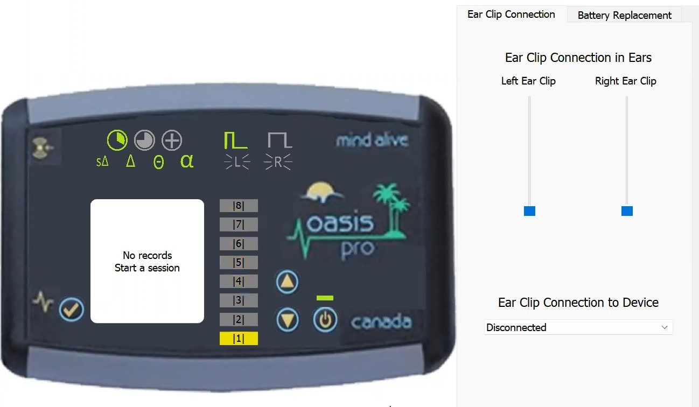
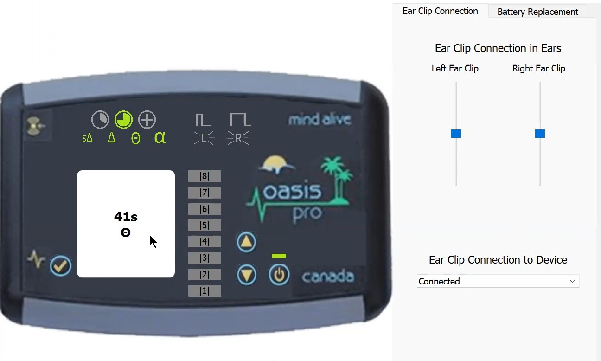
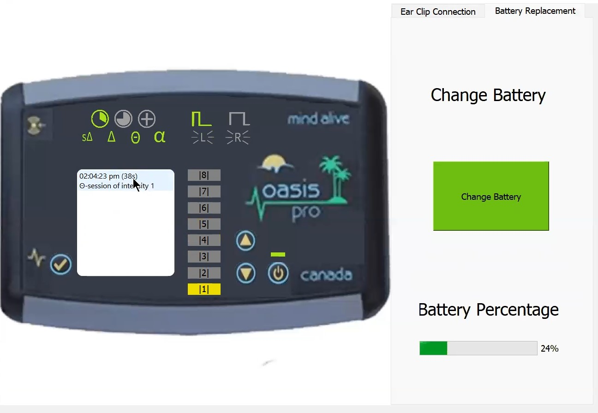

# Electrical Stimulation Device Emulator
A graphical desktop application created to emulate the [OASIS Pro](https://mindalive.com/products/oasis-pro) Cranio-Electro Stimulation (CES) device.
The device comes with a set of clips, which the user clips to their earlobes. The user can then use the device to select one of many available electro stimulation therapy sessions. An additional feature present in the emulator is the ability to record sessions which the user has selected to be recorded.

## Running the App
The application can be run directly on your computer. See the [releases](https://github.com/alejita11011/COMP3004-PROJECT/releases) page and download the executable file built for your operating system. Once downloaded, double-click the executable to run the application.

## Screenshots
### Device Powered On

### During a Session

### Recorded Session

## Development
All design and implementation was completed by the team:

[![][sebastian-img]][sebastian] [![][alejita-img]][alejita]  [![][liao-img]][liao]

[alejita]: https://github.com/alejita11011
[alejita-img]: https://github.com/alejita11011.png?size=50
[liao]: https://github.com/liaocanada
[liao-img]: https://github.com/liaocanada.png?size=50
[sebastian]: https://github.com/sebastiann3
[sebastian-img]: https://github.com/sebastiann3.png?size=50

The [Qt C++](https://www.qt.io/product/qt-for-desktop) framework was used for its development.

This project was created for the COMP 3004 Object-Oriented Software Engineering course at Carleton University.
